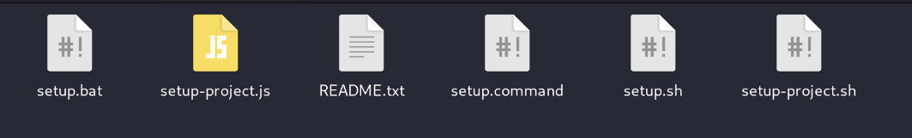

# Easy Expo Project Setup



This folder contains a simple, cross-platform setup tool for creating an
Expo/React Native app with NativeWind, tabs, Expo Router, and web support.

## Before you begin

You need Node.js installed first. Download it from [nodejs.org](https://nodejs.org)
(choose the LTS version) and use the installer with the default options.

## Windows

1. Double-click `setup.bat`.
2. If that does not work, right-click the folder, choose **Open in Terminal**,
   and run `node setup-project.js`.

## macOS

1. Double-click `setup.command`.
2. If nothing happens, right-click it and choose **Open**, then click **Open**
   again in the popup. If needed, run `chmod +x setup.command` once in Terminal.
3. If double-clicking still does not work, open Terminal in this folder and run
   `bash setup.command`.

## Linux

1. Double-click `setup.sh`.
2. If that does not work, right-click the folder, choose **Open in Terminal**,
   and type `bash setup.sh`.

If any launcher is incompatible with your system, you can always open a
terminal in this folder and run the JavaScript setup directly:

```bash
node setup-project.js
```

The script will ask you to name your app. You can also provide the name
directly, for example `node setup-project.js MyProjectName`.

## Command-line option

If you prefer to use a terminal, open this folder and run:

```bash
node setup-project.js MyProjectName
```

Replace `MyProjectName` with the name you want for your app. After setup finishes:

```bash
cd MyProjectName
npm run start
```

To open the app in a browser, run:

```bash
npm run web
```

Setup can take a few minutes. Keep the window open until you see `ALL DONE!`.
## Author

Created by [Boateng Adams](https://www.linkedin.com/in/adamsboateng/).


The script confirms that setup finished correctly. It does not guarantee that
the generated app builds or runs perfectly.
